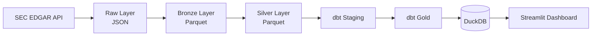

# SEC Filings Intelligence Pipeline

Pipeline de Engenharia de Dados para ingestão, processamento e modelagem analítica de dados corporativos disponibilizados pela SEC (U.S. Securities and Exchange Commission).

O projeto implementa uma arquitetura em múltiplas camadas (Raw → Bronze → Silver → Gold), seguindo práticas modernas de Data Engineering e Analytics Engineering, com orquestração via Airflow, testes automatizados (Pytest + dbt) e um dashboard interativo em Streamlit.

---

## Visão Geral

| Camada | Tecnologia | Responsabilidade |
|---|---|---|
| Orquestração | Apache Airflow | Agenda e encadeia a execução diária do pipeline |
| Ingestão | Python + `requests` | Coleta dados da SEC EDGAR API |
| Raw | JSON | Armazena a resposta original da SEC, sem transformações |
| Bronze | Parquet | Extração e flattening de campos relevantes |
| Silver | Parquet + DuckDB | Limpeza, tipagem, deduplicação e padronização |
| Gold | dbt + DuckDB | Modelagem analítica, dimensões e métricas de negócio/observabilidade |
| Apresentação | Streamlit + Plotly | Dashboard interativo com KPIs, tendências e saúde do pipeline |
| Qualidade | Pytest + dbt tests | Validação de schema, integridade e regras de negócio |
| CI/CD | GitHub Actions | Testes e validação do projeto dbt em cada push/PR |
| Containerização | Docker + Docker Compose | Ambiente reprodutível para Airflow |

---

## Arquitetura



---

## Estrutura do Projeto

```text
sec-filings-intelligence-pipeline/

├── data
│   ├── raw            # JSON bruto da SEC, particionado por data/CIK
│   ├── bronze         # Tabelas Parquet de primeiro processamento
│   ├── silver         # Tabelas Parquet limpas e deduplicadas
│   ├── warehouse       # Banco DuckDB consumido pelo dbt e pelo dashboard
│   ├── logs           # Logs de execução do pipeline
│   └── state          # Estado da última execução (last_run.json)
│
├── dbt
│   ├── models
│   │   ├── sources     # Definição das fontes (Silver layer)
│   │   ├── staging     # Padronização (stg_companies, stg_filings)
│   │   └── marts       # Modelos Gold (dimensões, fatos e observabilidade)
│   ├── tests           # Testes de negócio customizados (singular tests)
│   ├── dbt_project.yml
│   └── profiles.yml
│
├── airflow
│   ├── dags            # DAG de orquestração end-to-end
│   └── Dockerfile
│
├── src
│   ├── ingestion       # Cliente HTTP da SEC e lógica de ingestão
│   ├── bronze          # Parsing e construção da camada Bronze
│   ├── silver          # Construção da camada Silver via DuckDB
│   ├── dashboard       # App Streamlit, queries e componentes
│   ├── utils           # Configuração (pydantic-settings) e logging
│   └── main.py         # Entry point da ingestão (lê a watchlist)
│
├── tests                # Suíte Pytest (ingestion, bronze, silver)
│
├── requirements.txt
├── pyproject.toml
├── Dockerfile
├── docker-compose.yml
└── README.md
```

---

## Fonte de Dados

Os dados são obtidos através da API pública da SEC (EDGAR). Empresas são monitoradas utilizando seus respectivos CIKs (Central Index Key).

Exemplos atualmente utilizados:

* Apple (AAPL)
* Microsoft (MSFT)
* Amazon (AMZN)

---

## Camada Raw

Armazena os dados exatamente como retornados pela SEC, sem transformações, preservando o histórico de ingestões por data.

```text
data/raw/sec/
└── ingestion_date=YYYY-MM-DD
    └── cik=<CIK>
        └── submissions.json
```

---

## Camada Bronze

Primeiro processamento dos dados brutos: extração de campos relevantes, flattening de estruturas JSON e persistência em Parquet.

**`bronze_companies`** — informações cadastrais das empresas (`cik`, `company_name`, `ticker`, `exchange`, `sic`, `sic_description`, `state_of_incorporation`, `category`, `ingestion_date`, `source_file`).

**`bronze_filings_recent`** — registros de filings corporativos (`cik`, `accession_number`, `filing_date`, `report_date`, `acceptance_datetime`, `form`, `file_number`, `size`, `is_xbrl`, `is_inline_xbrl`, `primary_document`, `ingestion_date`, `source_file`).

---

## Camada Silver

Aplica limpeza, padronização, tipagem e deduplicação (via DuckDB) sobre a camada Bronze.

**`silver_companies`** — uma linha por empresa (último snapshot por CIK).

**`silver_filings`** — uma linha por filing (deduplicado por `cik` + `accession_number`), com campos de rastreabilidade (`ingestion_date`, `source_file`).

---

## Analytics Engineering com dbt

```text
models/
├── sources
├── staging
└── marts
```

### Staging

* **`stg_companies`** — padronização da dimensão de empresas.
* **`stg_filings`** — padronização dos registros de filings.

### Gold — Negócio

* **`gold_companies_latest`** — dimensão de empresas (nome, ticker, exchange, SIC, categoria SEC).
* **`gold_filings_summary`** — resumo analítico por empresa (total de filings, primeiro/último filing, total de 10-K/10-Q/8-K).
* **`gold_sic_summary`** — resumo agregado por setor econômico (SIC).
* **`gold_company_activity`** — atividade de filing por empresa.
* **`gold_form_distribution`** — distribuição de filings por tipo de formulário.
* **`gold_filing_trends`** — tendência mensal de filings.
* **`gold_recent_filings`** / **`gold_company_filings`** — filings mais recentes (globais e por empresa).

### Gold — Observabilidade

* **`gold_pipeline_metrics`** — snapshot da última execução (empresas, filings, empresas com atividade).
* **`gold_pipeline_execution_history`** — histórico incremental de execuções, usado para acompanhar o crescimento do volume ao longo do tempo.
* **`gold_data_quality`** — scorecard de qualidade de dados (nulos em campos-chave, filings duplicados, score percentual).

A documentação completa de cada modelo (descrição, colunas e grão) está em `dbt/models/schema.yml` e pode ser explorada com:

```bash
dbt docs generate --project-dir dbt --profiles-dir dbt
dbt docs serve --project-dir dbt --profiles-dir dbt
```

---

## Dashboard

Dashboard interativo em Streamlit ([src/dashboard/app.py](src/dashboard/app.py)), consumindo exclusivamente a camada Gold via DuckDB:

* Seletor de idioma (English / Português).
* **Pipeline Health** — métricas da última execução e gráfico de crescimento histórico.
* **Data Quality** — score de qualidade, nulos e duplicidades.
* **KPIs** — empresas, empresas com filings, total de filings, data do filing mais recente.
* **Tendências** — filings ao longo do tempo e distribuição por formulário.
* **Top Companies / SIC Summary** — empresas e setores com mais filings.
* **Company Explorer** — detalhe e histórico de filings por empresa.
* **Recent Filings** — filings mais recentes em toda a base.

As consultas ao DuckDB ([src/dashboard/queries.py](src/dashboard/queries.py)) são cacheadas com `@st.cache_data` (TTL de 5 minutos) para evitar reabrir o banco a cada interação do usuário.

Para rodar localmente:

```bash
streamlit run src/dashboard/app.py
```

> No Windows, se o `Ctrl+C` ficar travado em "Stopping...", verifique se há uma aba do navegador conectada ao app — é uma limitação conhecida do Streamlit nesse SO.

---

## Qualidade de Dados

### Testes Pytest

Cobertura das camadas de Ingestion, Bronze e Silver — parsing, persistência de arquivos, estrutura dos datasets e integridade dos dados.

```bash
pytest -v -m "not integration"
```

### Testes dbt

`unique`, `not_null`, `relationships` e validações avançadas via `dbt_expectations` (ex.: formato de CIK e de accession number), além de testes de negócio customizados (`dbt/tests/`):

```bash
dbt test --project-dir dbt --profiles-dir dbt
```

---

## Execução

### 1. Clonar o repositório

```bash
git clone https://github.com/vinisouzza/sec-filings-intelligence-pipeline.git
cd sec-filings-intelligence-pipeline
```

### 2. Criar ambiente virtual

```bash
python -m venv .venv
```

Windows

```bash
.venv\Scripts\activate
```

Linux/macOS

```bash
source .venv/bin/activate
```

### 3. Instalar dependências

```bash
pip install -r requirements.txt
pip install -e .
```

### 4. Configurar as variáveis de ambiente

Crie um arquivo `.env` na raiz do projeto contendo:

```text
SEC_USER_AGENT=Seu Nome seu@email.com
```

A SEC exige um *User-Agent* identificando a aplicação.

### 5. Configurar a watchlist

Crie o arquivo local `data/watchlist.txt` a partir de `watchlist.example.txt`.

Cada linha deve conter um CIK válido da SEC.

Exemplo:

```text
320193
789019
1018724
```

### 6. Executar a ingestão

```bash
python -m main
```

### 7. Construir a camada Bronze

```bash
python -m bronze.build_bronze
```

### 8. Construir a camada Silver

```bash
python -m silver.build_silver
```

### 9. Instalar os pacotes do dbt

```bash
dbt deps --project-dir dbt --profiles-dir dbt
```

### 10. Executar os modelos dbt

```bash
dbt run --project-dir dbt --profiles-dir dbt
```

### 11. Executar os testes dbt

```bash
dbt test --project-dir dbt --profiles-dir dbt
```

### 12. Iniciar o dashboard

```bash
streamlit run src/dashboard/app.py
```

---

## Executando o pipeline completo com Airflow

Inicialize os containers:

```bash
docker compose up airflow-init
docker compose up -d
```

A interface estará disponível em:

```
http://localhost:8080
```

Usuário:

```
admin
```

Senha:

```
admin
```

Após iniciar os serviços, execute a DAG `sec_filings_pipeline` pela interface do Airflow.

---

## Airflow

A orquestração end-to-end (`ingest → bronze → silver → dbt run → dbt test`) está definida em [airflow/dags/sec_filings_pipeline.py](airflow/dags/sec_filings_pipeline.py), com execução diária (`@daily`).

```bash
docker compose up -d
```

A UI do Airflow fica disponível em `http://localhost:8080` (usuário/senha: `admin` / `admin`, definidos em `docker-compose.yml`).

---

## Docker

O `Dockerfile` na raiz containeriza o ambiente Python do pipeline (ingestão, Bronze, Silver, dbt). O `docker-compose.yml` provisiona Postgres + Airflow (webserver e scheduler) com os volumes de `dags`, `src`, `dbt` e `data` montados para desenvolvimento local.

---

## CI

O workflow [`.github/workflows/ci.yml`](.github/workflows/ci.yml) roda em todo push/PR para `main`:

1. Instala dependências e o pacote em modo editável.
2. Roda a suíte Pytest (excluindo testes de integração).
3. Instala os pacotes dbt (`dbt deps`).
4. Valida o projeto dbt (`dbt parse`).


---

## Objetivo

Demonstrar a construção de um pipeline moderno de Engenharia de Dados utilizando arquitetura em camadas, testes automatizados, modelagem analítica com dbt, observabilidade de pipeline e processamento de dados corporativos da SEC.
